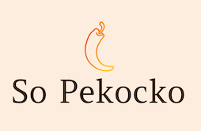

# Projet n°6 - Parcours Développeur Web - OpenClassrooms
## Création d'une API sécurisée pour l'application So Pekocko

Ce projet est réalisé dans le cadre du parcours **Développeur Web** du site [OpenClassrooms](https://openclassrooms.com/ "OpenClassrooms")

### Documentations
* [Note de cadrage](docs/cadrage.pdf)
* [Guidelines API](docs/guidelines.pdf)

### Front-end
Pour pouvoir utiliser l'API, vous pouvez cloner ce [répertoire Github](https://github.com/OpenClassrooms-Student-Center/dwj-projet6) et y suivre les instructions pour faire tourner le front-end (plus de détails dans la note de cadrage: Dépôt GitHub/Procédure).

### Technologies utilisées
* Express
* NodeJS
* MongoDB
* Mongoose

